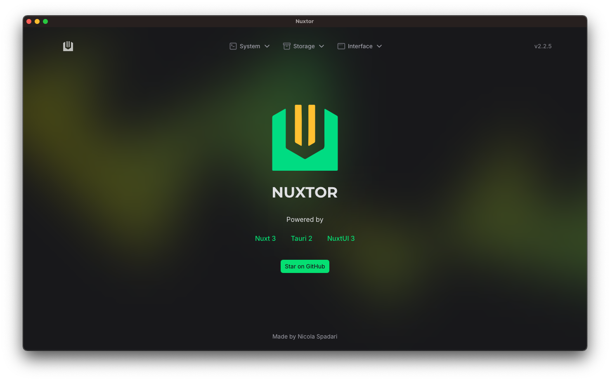

<p align="center">
    
</p>
<h1 align="center">Giessen.dev Transcriber</h1>
<p align="center">
A powerful voice-to-text transcription application built with <a href="https://nuxt.com">Nuxt 4</a> and <a href="https://v2.tauri.app">Tauri 2</a>
<br>
Transform your voice into text with local AI models!
</p>

<br />

<p float="left">
	
	
</p>

<br />

<div align="center">

</div>

<p align="center">Powered by Nuxt 4 & Local AI Models</p>

Check more screenshots at [preview](https://github.com/leamsigc/giessen.dev-transcription/blob/main/preview.md)

<br />

## Technologies

- **Nuxt v4** - Modern Vue.js framework
- **Tauri v2** - Build desktop apps with web technologies
- **NuxtUI v3** - Beautiful UI components
- **TailwindCSS v4** - Utility-first CSS framework
- **TypeScript** - Type-safe JavaScript
- **Hugging Face Transformers** - Local AI models for transcription
- **ONNX Runtime** - High-performance ML inference
- **Web Audio API** - Real-time audio processing
- **ESLint** - Code quality and consistency

## Features

- 🎤 **Real-time Voice Recording** - Record audio directly from your microphone
- 🧠 **Local AI Transcription** - Process speech using local ML models (no internet required)
- 💾 **Local Storage** - Save transcriptions securely on your device
- 🎨 **Modern UI** - Beautiful, responsive interface built with NuxtUI
- 🔔 **Smart Notifications** - Get notified when transcription starts and completes
- ⚙️ **Model Selection** - Choose from multiple AI transcription models
- 📝 **Transcription History** - View and manage all your past transcriptions
- 🔧 **Settings Management** - Customize microphone and model preferences
- 🖥️ **Cross-platform** - Works on Windows, macOS, and Linux

## Installation & Setup

### Prerequisites

- **Rust** - Required for Tauri. Install from [rustup.rs](https://rustup.rs/)
- **Node.js 23+** - Latest LTS version recommended
- **pnpm** - This project uses pnpm as package manager

### Quick Start

```sh
# Clone the repository
$ git clone https://github.com/leamsigc/giessen.dev-transcription.git
$ cd giessen.dev.audio-transcriber

# Install dependencies
$ pnpm install

# Start development mode
$ pnpm run tauri:dev
```

This will launch the application in development mode with hot reload.

### First Time Setup

1. **Grant Microphone Permissions** - The app will request microphone access on first run
2. **Download AI Models** - Models are downloaded automatically on first use
3. **Enable Notifications** - Allow notifications for transcription status updates

### Alternative Package Managers

If you prefer npm or yarn, update the following files:
- `package.json` - Remove the `preinstall` script
- `tauri.conf.json` - Update package manager configuration
## How It Works

The application uses local AI models to transcribe speech in real-time:

1. **Audio Capture** - Records audio from your microphone using Web Audio API
2. **Model Processing** - Processes audio with Hugging Face Transformers and ONNX Runtime
3. **Text Output** - Converts speech to text locally (no data sent to external servers)
4. **Storage** - Saves transcriptions to local Tauri store for future reference

## Build for Production

```sh
# Build optimized production version
$ pnpm run tauri:build
```

The built application will be available in `src-tauri/target/release/`.

## Debug Build

```sh
# Build with debug features and console access
$ pnpm run tauri:build:debug
```

Debug builds include developer tools and console output for troubleshooting.

## Important Notes

### Permissions & Security

- **Microphone Access** - Grant microphone permissions in your OS settings for recording
- **Notification Permissions** - Enable notifications to receive transcription status updates
- **Local Processing** - All transcription happens locally - your audio never leaves your device
- **Tauri Permissions** - Audio and storage permissions are configured in `src-tauri/capabilities/main.json`

### Technical Details

- **No SSR** - Nuxt SSR is disabled as Tauri serves as the backend
- **Auto Imports** - Tauri functions are auto-imported via custom modules in `app/modules/tauri.ts`
- **Model Downloads** - AI models are downloaded on first use and cached locally
- **Web Audio API** - Real-time audio processing with visual feedback

### UI & Design

- **NuxtUI** - Free version provides excellent components; Pro version available for enhanced features
- **Responsive Design** - Works on desktop and laptop screens
- **Dark/Light Mode** - Automatic theme detection and manual override options

## Contributing

We welcome contributions! Please feel free to submit issues and pull requests.

## License

MIT License © 2024-PRESENT [Leamsigc](https://github.com/leamsigc)
